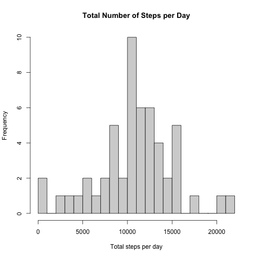
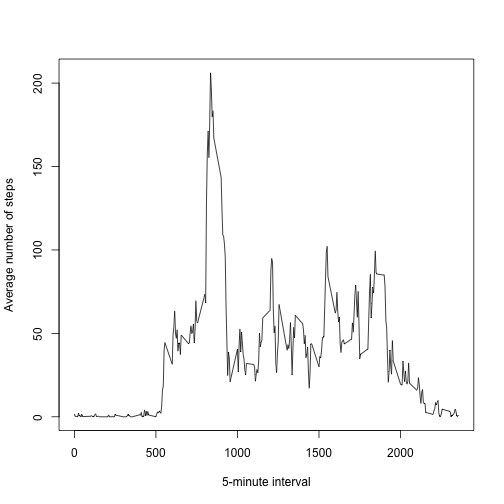
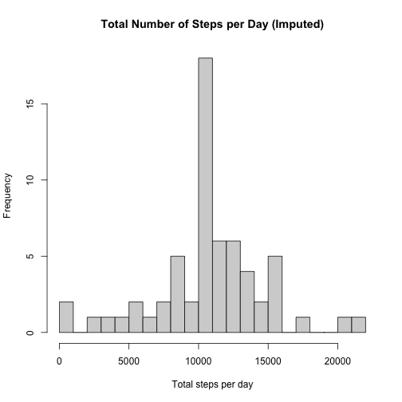
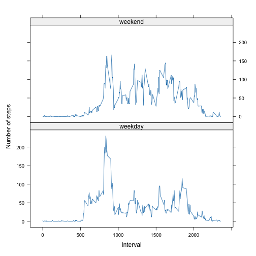

Reproducible Research: Peer Assessment 1
========================================

## Loading and preprocessing the data


``` r
# Load data
activity <- read.csv("activity.csv", stringsAsFactors = FALSE)

# Convert date to Date class
activity$date <- as.Date(activity$date)
```


## What is mean total number of steps taken per day?

For this part of the assignment, you can ignore the missing values in the dataset.


``` r
# Set sum of steps per day (ignore NA)
steps_per_day <- aggregate(
  steps ~ date,
  data = activity,
  FUN = sum,
  na.rm = TRUE
)
```


``` r
# Create a histogram
hist(
  steps_per_day$steps,
  breaks = 20,
  main = "Total Number of Steps per Day",
  xlab = "Total steps per day"
)
```




``` r
# Calculate mean and median
mean_steps <- mean(steps_per_day$steps)
median_steps <- median(steps_per_day$steps)

mean_steps
```

```
## [1] 10766.19
```

``` r
median_steps
```

```
## [1] 10765
```

## What is the average daily activity pattern?

Make a time series plot (i.e. type = "l" type = "l"start color red, start verbatim, type = "l", end verbatim, end color red) of the 5-minute interval (x-axis) and the average number of steps taken, averaged across all days (y-axis)


``` r
avg_steps_interval <- aggregate(
  steps ~ interval,
  data = activity,
  FUN = mean,
  na.rm = TRUE
)

plot(
  avg_steps_interval$interval,
  avg_steps_interval$steps,
  type = "l",
  xlab = "5-minute interval",
  ylab = "Average number of steps"
)
```



Which 5-minute interval, on average across all the days in the dataset, contains the maximum number of steps?


``` r
max_interval <- avg_steps_interval$interval[
  which.max(avg_steps_interval$steps)
]

max_interval
```

```
## [1] 835
```

The interval variable is an identifier and not clock time.

## Imputing missing values

Note that there are a number of days/intervals where there are missing values (coded as NA). The presence of missing days may introduce bias into some calculations or summaries of the data.

Calculate and report the total number of missing values in the dataset (i.e. the total number of rows with NAs)


``` r
num_missing <- sum(is.na(activity$steps))
num_missing
```

```
## [1] 2304
```

Imputation strategy: Use mean for each 5-minute interval
Create a new dataset that is equal to the original dataset but with the missing data filled in.


``` r
# Create lookup table of interval means
interval_means <- avg_steps_interval

# Copy dataset
activity_filled <- activity

# Fill missing values
missing_idx <- is.na(activity_filled$steps)

activity_filled$steps[missing_idx] <-
  interval_means$steps[
    match(activity_filled$interval[missing_idx],
          interval_means$interval)
  ]
```

Make a histogram of the total number of steps taken each day and Calculate and report the mean and median total number of steps taken per day.


``` r
steps_per_day_filled <- aggregate(
  steps ~ date,
  data = activity_filled,
  FUN = sum
)

hist(
  steps_per_day_filled$steps,
  breaks = 20,
  main = "Total Number of Steps per Day (Imputed)",
  xlab = "Total steps per day"
)
```




``` r
mean_filled <- mean(steps_per_day_filled$steps)
median_filled <- median(steps_per_day_filled$steps)

mean_filled
```

```
## [1] 10766.19
```

``` r
median_filled
```

```
## [1] 10766.19
```

After imputing missing values using interval means, the distribution of daily step totals becomes more symmetric, resulting in identical mean and median values.


## Are there differences in activity patterns between weekdays and weekends?

Create weekday/weekend factor


``` r
# Create weekday / weekend factor
activity_filled$day_type <- ifelse(
  weekdays(activity_filled$date) %in% c("Saturday", "Sunday"),
  "weekend",
  "weekday"
)

# Convert to factor with explicit ordering
activity_filled$day_type <- factor(
  activity_filled$day_type,
  levels = c("weekday", "weekend")
)

# Average steps per interval and day type
avg_interval_daytype <- aggregate(
  steps ~ interval + day_type,
  data = activity_filled,
  FUN = mean
)
```

Make a panel plot


``` r
library(lattice)

xyplot(
  steps ~ interval | day_type,
  data = avg_interval_daytype,
  type = "l",
  layout = c(1, 2),
  xlab = "Interval",
  ylab = "Number of steps"
)
```



Overall, activity patterns differ substantially between weekdays and weekends, with higher average activity during weekends.
